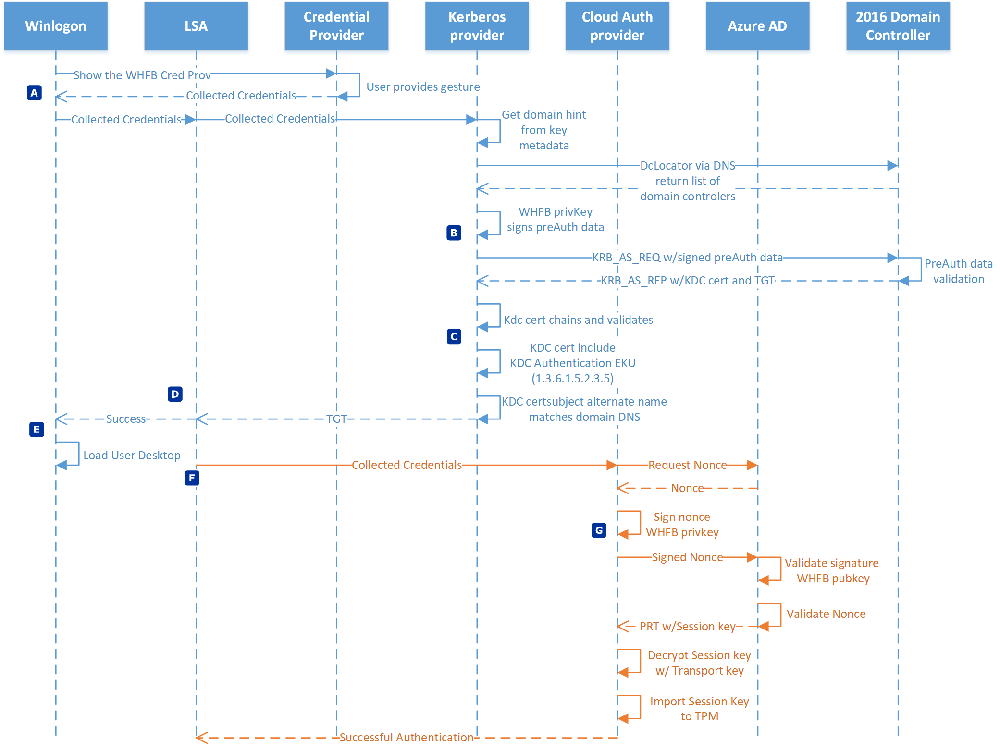
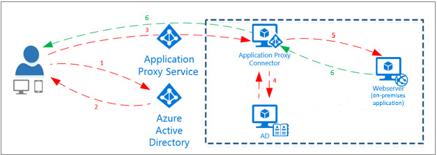
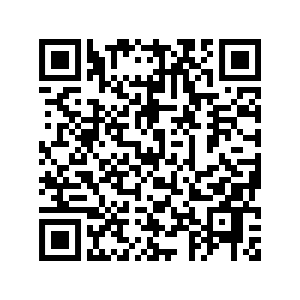

# Journey to Passwordless

## Windows Hello for Business
[Windows Hello for Business](https://learn.microsoft.com/en-us/windows/security/identity-protection/hello-for-business/hello-identity-verification)

- Easy for user
  - Uses PIN to login
- Secure
  - Private key secured by TPM
- Qualifies as MFA to meet compliance requirements
  - i.e. Salesforce, etc.

### Tech Details on How it Works
[How Windows Hellow for Business Works](https://learn.microsoft.com/en-us/windows/security/identity-protection/hello-for-business/hello-how-it-works-authentication)

## Seamless SSO
[Azure Seamless SSO](https://learn.microsoft.com/en-us/azure/active-directory/hybrid/connect/how-to-connect-sso)

## Conditional Access MFA
[Azure Conditional Access](https://learn.microsoft.com/en-us/azure/active-directory/conditional-access/howto-conditional-access-policy-all-users-mfa)

- Better user experiance
- Avoid MFA fatigue
- Require MFA for flagged high risk logins
  - Impossible travel
  - Token reuse

## Certificate Based Authentication
[VPN or Wireless Authentintication](https://learn.microsoft.com/en-us/mem/intune/configuration/wi-fi-settings-configure)

- Better user experiance
- More secure than password

## Azure Application Proxy
[SSO without VPN](https://learn.microsoft.com/en-us/azure/active-directory/app-proxy/application-proxy)

- Better user experiance
- Avoid VPN requirement for on prem apps
- Supports SSO

## Azure AD Custom Branding
[Add Custom Branding to Sign-on Page](https://learn.microsoft.com/en-us/azure/active-directory/fundamentals/how-to-customize-branding)

- Helps user recognize legitmacy
- Helps identify red flag on phishing emails

## Complex Password without Experation Policy

[NIST Recommendation](https://pages.nist.gov/800-63-FAQ/#q-b05)

- Does not recommend password age requirement
- Does not recommend complex password composition rules
- Recommends secure 15+ character passphrase

## Phishing Awareness Training
[Microsoft Attack Simulator](https://learn.microsoft.com/en-us/microsoft-365/security/office-365-security/attack-simulation-training-get-started?view=o365-worldwide)

- Continue end user phishing training
- Emphisize users should never be prompted for password or MFA while on work computer

## Benifits

- Better user experiance
- Less support tickets
- Passwords more secure
  - Tougher to crack
- Almost phish resistant
  - Use many times do not know what their password is

## What it Does Not Help With

- Traditional Red Team tools - Mimikatz
  - Credentials can be secured using [Credential Guard](https://learn.microsoft.com/en-us/windows/security/identity-protection/remote-credential-guard)
- Legacy systems that do not support modern auth (i.e. NTLM)

## QR Code for Resources

